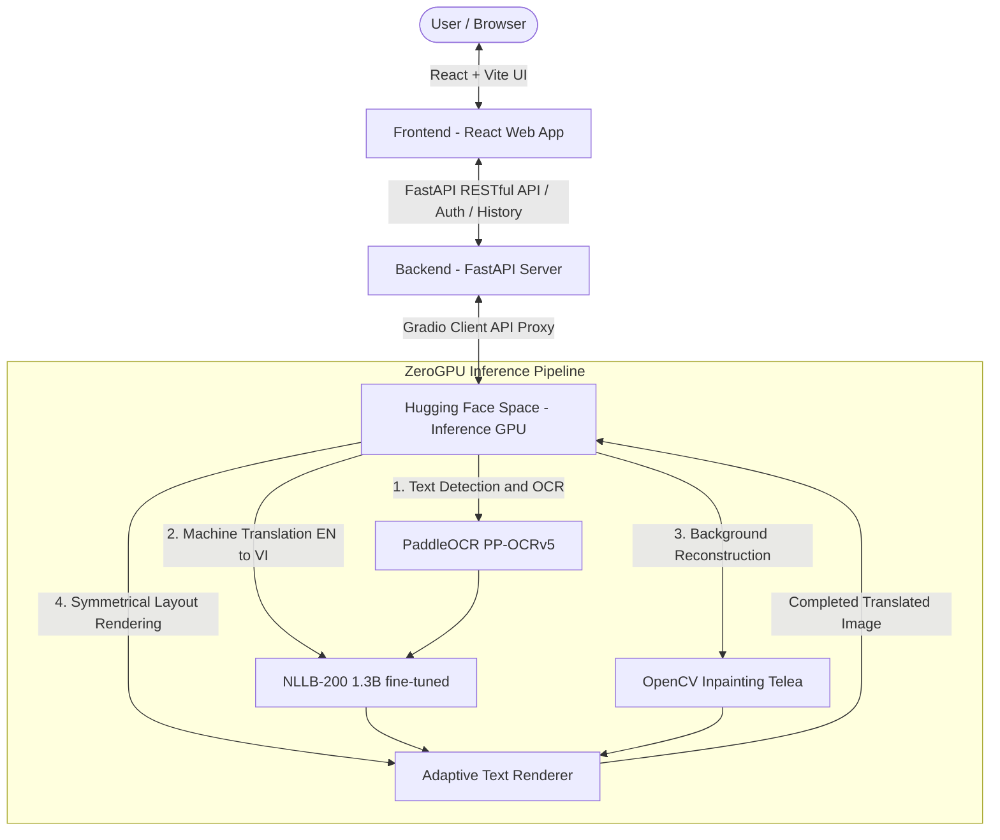

# VieTrans: In-Image Machine Translation (EN to VI)

VieTrans is a multi-stage In-Image Machine Translation system. It detects, translates, and renders translated text (English to Vietnamese) directly onto images while preserving the original real-world background.

---

## System Architecture

The project is built on a split architecture consisting of an interactive User Interface, a Middle Server, and an AI Inference Space:



---

## Technical Stack

| Component | Main Technologies | Role and Features |
| :--- | :--- | :--- |
| **Frontend (FE)** | React 18, Vite, TypeScript, TailwindCSS, Lucide Icons, HTML5 Canvas API | Provides the image editing studio, split-screen comparison slider, history list, and interactive API documentation. |
| **Backend (BE)** | FastAPI, Python 3.10+, MongoDB (Motor driver), JWT, Bcrypt | Handles registration, login, token authentication, user history management, and proxies image uploads to the Hugging Face Space. |
| **Inference (Space)** | PyTorch, Hugging Face ZeroGPU, Gradio, PaddleOCR, NLLB-200, OpenCV | Runs the deep learning models for text recognition, NMT translation, background inpainting, and layout alignment. |

---

## Key Features

1. **Professional Studio Workspace:**
   * Full Canvas editing tools: Brush, Eraser, and custom Text Overlay.
   * Mouse-drag background panning when the Select tool is active.
   * Viewport scaling including Auto-fit (Zoom-to-Screen) and direct percentage input (from 10% to 500%).
2. **Interactive Comparison Slider:**
   * Split-screen range slider allowing users to compare original and translated images side-by-side.
3. **Pipeline Stages Visualization:**
   * Inspects intermediate stages: Original Input -> Text Detection -> Inpainted Background -> Final Fused Image.
4. **Interactive API Documentation:**
   * Built-in API docs with custom styled endpoint badges (GET/POST), code syntax highlighting, and sample response payload mock viewers.
5. **Authentication and Session History:**
   * Signup, login, password recovery, profile settings, and persistent cloud translation history.

---

## Local Setup and Installation

### Prerequisites

Before starting, ensure you have the following installed on your system:
* **Node.js 18+** & **npm**
* **Python 3.10+** (with virtual environment support like venv)
* **MongoDB** (running locally or accessible via a remote URI)

### 1. Backend Setup (FastAPI Server)

Open your terminal and navigate to the backend directory:

```bash
cd BE-Models
# Create and activate virtual environment
python3 -m venv venv
source venv/bin/activate  # On Windows: venv\Scripts\activate

# Install dependencies
pip install -r requirements.txt
```

Create an environmental configuration file at `BE-Models/server/env` or configure your system environment variables:

```ini
MONGO_URI=mongodb://localhost:27017
MONGO_DB=vietrans
SECRET_KEY=your_jwt_secret_key_here
MAIL_USERNAME=your_email@example.com
MAIL_PASSWORD=your_email_password
MAIL_FROM=your_email@example.com
VIETRANS_SPACE_URL=https://masterdzzzz-vietrans-modelspace.hf.space
```

To run the backend API server locally, navigate to the `server` directory and launch uvicorn:

```bash
cd server
python3 -m uvicorn app:app --host 0.0.0.0 --port 8000 --reload
```
The API server will be available at: `http://localhost:8000`

### 2. Frontend Setup (React UI)

Open a new terminal and navigate to the frontend directory:

```bash
cd FE
# Install dependencies
npm install

# Run the local development server
npm run dev
```
The UI application will be available at: `http://localhost:5173`

---

## Deployment Configuration

* **Frontend:** Deployed to Vercel or Netlify. A `netlify.toml` file is included to configure redirect rules for routing Single Page Apps (SPA) correctly.
* **Backend:** Runs in docker containers or standard virtual environments on cloud VPS, communicating with MongoDB.
* **Inference Space:** Hosted on Hugging Face Spaces (using ZeroGPU SDK). Ensure the following repository secrets are set in the Space settings:
  * `NLLB_MODEL_PATH`: Model repository path (e.g. `tientaiuu/mt-nllb-1p3b-en-vi`).
  * `NLLB_SRC_LANG`: Source language identifier (e.g. `eng_Latn`).
  * `NLLB_TGT_LANG`: Target language identifier (e.g. `vie_Latn`).
  * `OCR_MIN_CONFIDENCE`: Float boundary for text detection confidence filtering (e.g. `0.5`).


