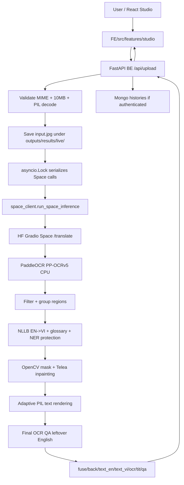
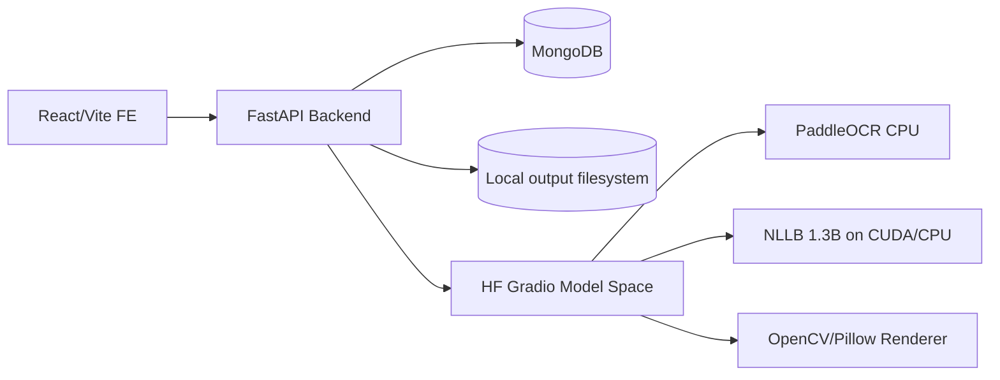
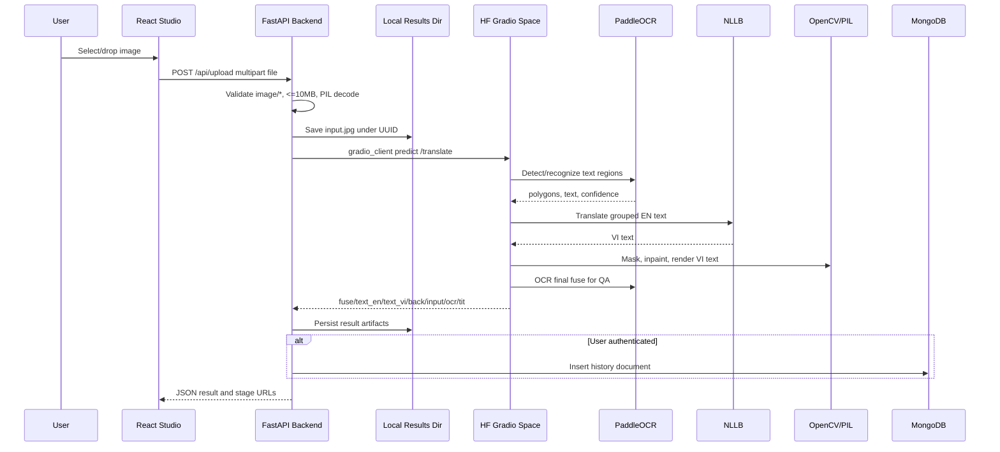
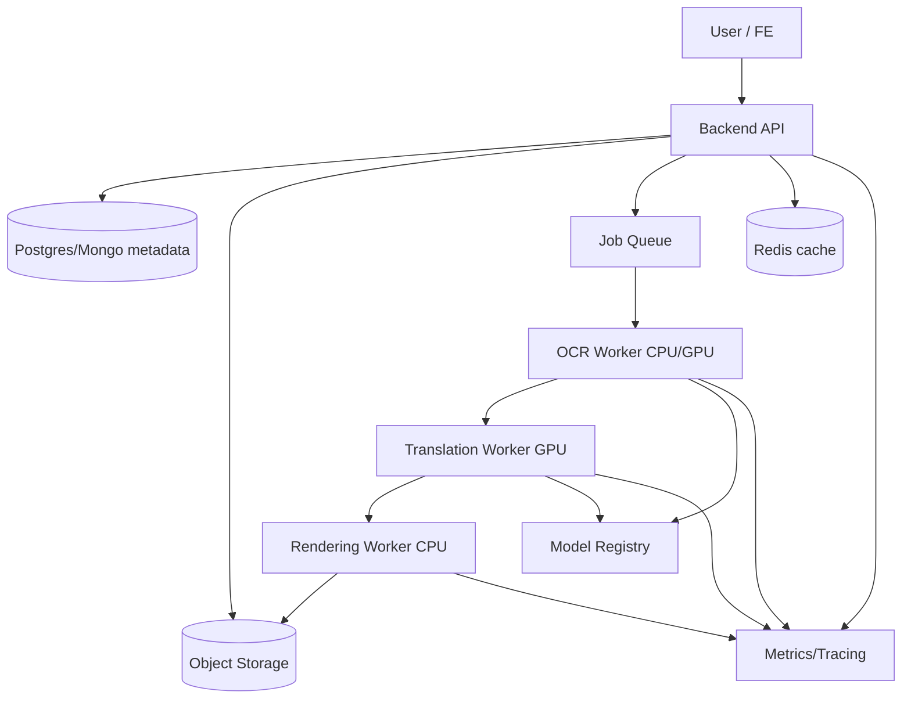

# VieTrans - Bao cao ky thuat he thong dich anh

Ngay lap bao cao: 2026-06-30  
Pham vi: phan tich source code hien co trong worktree `VieTrans`, theo trang thai file tren dia tai thoi diem quet. Worktree dang co nhieu thay doi chua commit; cac file tracked bi xoa nhu `BE-Models/configs/*`, `BE-Models/src/*`, `BE-Models/scripts/ocr.py`, `BE-Models/mockdata/*` duoc ghi nhan la khong con trong source code hien tai nen khong duoc xem la thanh phan runtime hien hanh.

## Muc luc

1. Phan loai file quan trong truoc khi viet bao cao
2. Executive Summary
3. Tong quan he thong dich anh
4. Cau truc repository
5. Tech stack
6. Kien truc tong the
7. Pipeline xu ly anh
8. AI/ML model analysis
9. Model serving va inference
10. API analysis
11. Data flow
12. Database va storage
13. Job processing/queue
14. Error handling
15. Security assessment
16. Performance va scalability
17. Observability
18. Code quality
19. Testing
20. Deployment va DevOps
21. Cost analysis
22. Technical risks
23. Refactoring opportunities
24. Kien truc muc tieu
25. Roadmap nang cap
26. Ket luan

## 1. Phan loai file quan trong truoc khi viet bao cao

Bang nay la buoc phan loai bat buoc truoc phan tich. Cac file sinh ra nhu `venv/`, `FE/dist/`, `.codex-tmp-exact-fec236/`, va tung thu muc ket qua trong `BE-Models/outputs/results/live/<uuid>/` khong duoc liet ke tung file vi la artifact/runtime output, nhung pattern storage cua chung duoc ghi nhan.

| Nhom | File/thu muc quan trong | Vai tro | Ghi chu |
| --- | --- | --- | --- |
| API | `BE-Models/server/app.py` | FastAPI routes chinh: health, pipeline info, sample/image serving, upload, download, update fuse, history | Entry point backend |
| API | `BE-Models/server/auth.py` | Auth API: register/login/forgot/reset/me/change-password | Dung MongoDB, JWT, bcrypt, email |
| API | `BE-Models/server/space_client.py` | Client goi Gradio Space qua `gradio_client.Client.predict()` | Moi duoc them, backend proxy inference remote |
| API | `FE/src/api.ts` | Frontend API client cho upload/history/download/auth | Dinh nghia contract FE-BE |
| Service | `FE/src/stores/useStudioStore.ts` | Queue xu ly anh frontend, goi `uploadImage()` tuan tu | Progress hien dang mo phong |
| Service | `FE/src/stores/useAppStore.ts`, `FE/src/stores/useToastStore.ts` | Auth/session va toast state | Ho tro UX, khong phai inference |
| Service | `FE/src/features/studio/StudioPage.tsx` | Man hinh studio, queue, preview, download, edit fuse | Workflow nguoi dung |
| Model | `Space/inference.py` | Lop `DebackPipeline`, orchestration OCR -> translation -> inpaint -> render -> QA | Runtime model chinh tren HF Space |
| Model | `Space/vietrans_space_inference/model_loader.py` | Load PaddleOCR va NLLB model | Dung `PaddleOCR`, `AutoModelForSeq2SeqLM`, `AutoTokenizer` |
| Model | `BE-Models/server/inference.py` | Ban sao/legacy inference pipeline | Backend hien khong import file nay trong `app.py`; rui ro trung lap |
| Model | `BE-Models/server/vietrans_space_inference/*` | Ban sao helper modules inference | Trung lap voi `Space/vietrans_space_inference/*` |
| OCR | `Space/vietrans_space_inference/model_loader.py` | Khoi tao PaddleOCR PP-OCRv5, `lang="en"`, `device="cpu"` | OCR detection + recognition |
| OCR | `Space/inference.py` | Parse OCR result, confidence threshold, ve overlay `text_en.jpg` | `_parse_paddleocr_result`, `_run_ocr` |
| Translation | `Space/inference.py` | Batch translate EN -> VI bang NLLB, glossary, NER protection | `_translate_texts`, `_protect_named_entities` |
| Translation | `Space/vietrans_space_inference/text_processing.py` | UI glossary, skip rules, grouping line/paragraph | Rule-based post-processing |
| Image processing | `Space/inference.py` | Mask, inpainting, render text, style estimate | OpenCV + PIL |
| Image processing | `Space/vietrans_space_inference/font_utils.py` | Tim font, cache font, wrapping helpers | Phuc vu render tieng Viet |
| Image processing | `Space/vietrans_space_inference/sizing.py` | Fit font, wrap text, paragraph sizing | Phuc vu layout preservation |
| Image processing | `Space/vietrans_space_inference/layout_position.py` | Render box va line positioning | Phuc vu alignment |
| Image processing | `Space/vietrans_space_inference/style_harmonization.py` | Dong bo style cho label lap lai | Heuristic visual consistency |
| Image processing | `FE/src/features/studio/components/CanvasEditor.tsx` | Chinh sua anh ket qua tren canvas va save fuse | Client-side post-edit |
| Storage | `BE-Models/server/app.py` | Luu output local vao `BE-Models/outputs/results/live/<uuid>/` | `input/back/text_en/text_vi/fuse/ocr/tit/qa` |
| Storage | `BE-Models/server/auth.py` | MongoDB collections `users`, `reset_tokens`, `histories` | Khong co schema migration |
| Storage | `BE-Models/outputs/results/live/*` | Runtime artifact local | Hien co 360 thu muc live khi quet; bi ignore boi `BE-Models/.gitignore` |
| Config | `BE-Models/server/.env.example` | Mongo, JWT, mail, CORS, Space endpoint, HF token | Mau config backend |
| Config | `FE/.env.example`, `FE/.env.production` | `VITE_API_URL` local/prod | Frontend endpoint config |
| Config | `Space/requirements.txt`, `Space/packages.txt` | Dependency Python/system cho HF Space | PaddleOCR, PyTorch, Transformers, OpenCV |
| Config | `BE-Models/server/requirements.txt`, `BE-Models/requirements.txt` | Dependency backend | API + auth + gradio-client |
| Config | `FE/package.json`, `FE/package-lock.json` | Dependency/scripts frontend | React/Vite/Tailwind/Zustand |
| Config | `.gitignore`, `BE-Models/.gitignore`, `FE/.gitignore`, `Space/.gitattributes` | Ignore/LFS policy | `.env`, outputs, model binaries |
| Deployment | `BE-Models/Dockerfile` | Docker image cho backend HF Space, port 7860 | Chay `uvicorn server.app:app` |
| Deployment | `Space/README.md` | HF Space metadata, Docker SDK, port 7860 | Model Space |
| Deployment | `FE/netlify.toml`, `FE/public/_redirects` | Netlify build va SPA routing | Frontend deploy |
| Deployment | `upload_space.py`, `upload_be.py`, `upload_model.py`, `upload_index.py` | Upload thu cong len Hugging Face | Yeu cau token input/env |
| Testing | Khong co file test hien hanh | **Không tìm thấy trong source code**: unit/integration/e2e test suite | `rg` khong thay `pytest`, `vitest`, `jest`, `playwright`, `*.test*` |

## 2. Executive Summary

VieTrans la he thong dich chu trong anh EN -> VI. Nguoi dung upload anh tu frontend React; backend FastAPI validate/coerce anh, luu `input.jpg`, goi Hugging Face Gradio Space remote de chay inference, nhan cac anh stage va text tra ve, luu ket qua local, va neu co JWT thi ghi history vao MongoDB. Inference that su nam o `Space/app.py` va `Space/inference.py`, voi pipeline PaddleOCR PP-OCRv5 CPU -> NLLB-200 1.3B fine-tuned EN-VI -> OpenCV inpainting -> adaptive PIL rendering -> QA OCR lai.

Input chinh: file anh qua `POST /api/upload`. Output chinh: JSON chua `matched_id`, `tit`, `ocr`, URL cac stage `input/back/text_en/text_vi/fuse`; dong thoi co endpoint download jpg/png/webp. Cac model AI/ML tim thay trong source code: PaddleOCR PP-OCRv5 cho OCR, NLLB model `masterdzzzz/mt-nllb-1p3b-en-vi` cho dich, va lazy BERT NER `dslim/bert-base-NER` de bao ve ten rieng. **Không tìm thấy trong source code**: model inpainting deep learning; inpainting hien dung OpenCV Telea.

| Hang muc | Diem /10 | Nhan xet |
| --- | ---: | --- |
| Architecture | 6 | Tach FE/BE/Space hop ly cho prototype, nhung backend sync proxy va duplicate inference code |
| Model Integration | 7 | Load model singleton, co batch translation, FP16 tren CUDA, CPU OCR on dinh |
| Inference Performance | 5 | Co batch size 4 va cache font, nhung OCR + beam search + final OCR QA sync, khong benchmark |
| Scalability | 4 | Backend dung `asyncio.Lock` serialize Space calls; khong queue/worker/status async |
| Security | 4 | Co JWT/bcrypt va 10MB limit, nhung upload validation con mong, SECRET_KEY fallback random, update-fuse khong auth |
| Maintainability | 5 | Pipeline modular hoa mot phan, nhung co duplicate `inference.py` va helper modules giua BE/Space |
| Observability | 3 | Chu yeu `print`, khong metric/tracing/request id/model latency |
| Production Readiness | 4 | Phu hop MVP/prototype; can queue, cleanup, monitoring, tests, secret hardening |

Rui ro lon nhat: request upload bi xu ly synchronous den remote Space va bi serialize boi `space_call_lock` trong `BE-Models/server/app.py`, nen chi can Space cham/cold start/loi la backend bi tac. Thanh phan manh nhat la pipeline render co nhieu heuristic layout/style va QA leftover-English. Thanh phan yeu nhat la production controls: testing, observability, queue, storage retention, security upload.

## 3. Tong quan he thong dich anh

Theo code thuc te, pipeline end-to-end hien tai:

Khong co queue, worker rieng, job status, retry policy, model registry, result cache theo image hash, hay database schema migration trong source code.

## 4. Cau truc repository

| Path | Vai tro | Ghi chu |
| --- | --- | --- |
| `README.md` | Mo ta kien truc 3 phan: `Space`, `BE-Models`, `FE` | Neu default Space URL duoc set qua env |
| `Space/` | Hugging Face Space chay model inference | `app.py` launch Gradio, `inference.py` pipeline |
| `Space/vietrans_space_inference/` | Helper modules cho model/render/QA | Module hoa tu phan cuoi `inference.py` |
| `BE-Models/` | Backend FastAPI deploy HF Space | Dockerfile port 7860 |
| `BE-Models/server/` | API server + auth + Space client | `inference.py` o day khong duoc import boi `app.py` |
| `FE/` | React + Vite frontend | Studio, dashboard, auth, docs |
| `upload_*.py` | Script upload thu cong len Hugging Face | Khong phai CI/CD |
| `BE-Models/outputs/results/live/` | Ket qua runtime local | Pattern storage quan trong, khong nen commit |

Entry point runtime:

| Component | Entry point | Lenh/route |
| --- | --- | --- |
| Backend | `BE-Models/server/app.py` | `uvicorn app:app --host 0.0.0.0 --port 8000` local; Docker chay `server.app:app` port 7860 |
| Space | `Space/app.py` | `demo.launch(server_name="0.0.0.0", server_port=7860)` |
| Frontend | `FE/src/main.tsx`, `FE/src/App.tsx` | `npm run dev` / `npm run build` |

## 5. Tech stack

| Thanh phan | Cong nghe | Vai tro | File lien quan |
| --- | --- | --- | --- |
| Frontend | React 19, Vite, TypeScript, Zustand, Tailwind | Studio UI, queue, auth UI, download/edit | `FE/package.json`, `FE/src/api.ts` |
| Backend API | FastAPI, Uvicorn | API proxy, static result serving, history | `BE-Models/server/app.py` |
| Auth | JWT HS256, bcrypt, FastAPI security | Register/login/profile/password reset | `BE-Models/server/auth.py` |
| Database | MongoDB via Motor | users/reset_tokens/histories | `BE-Models/server/auth.py`, `app.py` |
| Remote inference client | `gradio-client`, `httpx`, PIL | Goi Space, tai/luu anh tra ve | `BE-Models/server/space_client.py` |
| OCR | PaddleOCR PP-OCRv5, PaddlePaddle | Text detection + recognition | `Space/vietrans_space_inference/model_loader.py` |
| Translation | Hugging Face Transformers, PyTorch, SentencePiece | NLLB Seq2Seq EN -> VI | `Space/inference.py`, `model_loader.py` |
| NER | Transformers pipeline `dslim/bert-base-NER` | Bao ve ten rieng | `Space/inference.py` |
| Image processing | Pillow, NumPy, OpenCV headless | Decode, mask, inpaint, render | `Space/inference.py` |
| Serving model | Gradio + Hugging Face `spaces` ZeroGPU | UI/API `/translate`, GPU decorator | `Space/app.py` |
| Deployment | HF Spaces Docker/SDK, Netlify | BE/Space/FE deploy | `BE-Models/Dockerfile`, `Space/README.md`, `FE/netlify.toml` |
| Monitoring | **Không tìm thấy trong source code** | Chi co `print` va `/api/health` don gian | N/A |
| Testing | **Không tìm thấy trong source code** | Khong co test suite | N/A |

## 6. Kien truc tong the

Kien truc hien tai la hybrid monolith/proxy: frontend la SPA rieng, backend la API monolith cho auth/storage/proxy, model serving nam trong Gradio Space rieng. Backend khong chay model truc tiep trong request `/api/upload`; no goi remote Space qua `space_client.run_space_inference()`.

Danh gia theo cau hoi kien truc:

| Cau hoi | Ket qua theo source code | Bang chung |
| --- | --- | --- |
| Monolith hay microservice | 3 thanh phan deploy rieng, backend monolith + model Space rieng | `README.md`, `BE-Models/server/space_client.py` |
| Sync hay async | API upload async nhung inference remote duoc goi sync trong thread va bi lock | `BE-Models/server/app.py:262-265` |
| API-based hay worker-based | API-based | Khong co worker/queue |
| Co queue | **Không tìm thấy trong source code** | Khong co Celery/RQ/Redis worker |
| Model server rieng | Co: HF Gradio Space | `Space/app.py`, `space_client.py` |
| GPU inference | Co cho NLLB neu CUDA/ZeroGPU available | `Space/app.py:145`, `Space/inference.py:2335-2340` |
| Batch processing | Co batch translation size 4 trong mot anh; FE queue xu ly tuan tu nhieu anh | `Space/inference.py:2418-2421`, `FE/src/stores/useStudioStore.ts` |
| Cache ket qua | **Không tìm thấy trong source code**: cache theo image hash/result | Co font cache va singleton model, khong cache output |

## 7. Pipeline xu ly anh

### 7.1 Image input

Backend `POST /api/upload` kiem tra `file.content_type.startswith("image/")`, doc toan bo body, gioi han 10MB, tao UUID, luu anh bang PIL `Image.open(...).convert("RGB")` thanh JPEG quality 95. Bang chung: `BE-Models/server/app.py:236-265`.

Nhung diem **Không tìm thấy trong source code**:

- Allowlist extension.
- MIME sniffing bang magic bytes.
- Resolution/pixel limit.
- `Image.MAX_IMAGE_PIXELS` hay chong decompression bomb.
- EXIF orientation correction.
- Antivirus/malicious image scanning.
- Cleanup/retention policy cho uploaded/result files.

Frontend `UploadZone` chi dung `<input accept="image/*">` va drag-drop, khong enforce size/type truoc upload trong `FE/src/features/studio/components/UploadZone.tsx`.

### 7.2 Image preprocessing

Preprocessing thuc te rat nhe:

- Backend decode va convert RGB truoc khi proxy Space.
- Space convert input PIL/numpy thanh RGB JPEG trong `Space/app.py`.
- Pipeline doc input bang `Image.open(input_img_path).convert("RGB")` trong `Space/inference.py:2483`.
- PaddleOCR khoi tao voi `use_doc_orientation_classify=False`, `use_doc_unwarping=False`, `use_textline_orientation=False`, `enable_mkldnn=False` trong `Space/vietrans_space_inference/model_loader.py`.

**Không tìm thấy trong source code**: resize, normalize, denoise, deskew, grayscale, contrast enhancement, binarization, perspective correction. Dieu nay lam pipeline don gian nhung de suy giam chat luong voi anh mo, nghieng, qua lon, nen nen bo sung preprocessing tuy chon.

### 7.3 Text detection va recognition

OCR dung `PaddleOCR(lang="en", ocr_version="PP-OCRv5", device="cpu")`. Day la model OCR detection + recognition trong mot engine, khong tach rieng detector/recognizer trong code. `_run_ocr()` goi `self.ocr_engine.predict(str(image_path))`, parse `rec_texts`, `rec_scores`, `rec_polys`/`dt_polys`; fallback legacy list-of-lists neu can. Bang chung: `Space/inference.py:204-240`, `Space/inference.py:2381-2399`.

Output moi region gom:

- `polygon`
- `box`
- `detector_text`
- `detector_confidence`
- `index`

Threshold confidence la env `OCR_MIN_CONFIDENCE`, default `0.5` trong `Space/inference.py:89`. **Không tìm thấy trong source code**: NMS custom; PaddleOCR noi bo co the co, nhung khong duoc expose trong source code. Multi-line text duoc group boi `_group_paragraph_regions()` trong `Space/vietrans_space_inference/text_processing.py`.

### 7.4 Language detection

**Không tìm thấy trong source code**: model language detection. Code dung heuristic trong `_should_translate_region()`:

- skip domain/handle
- skip UI token khong dich nhu Wi-Fi/SIM/Bluetooth
- skip numeric-only
- skip phonetic
- skip text da co dau tieng Viet hoac unaccented Vietnamese words
- yeu cau co Latin letters va kich thuoc bbox toi thieu

Bang chung: `Space/vietrans_space_inference/text_processing.py`, `_should_translate_region`; ban inline cung xuat hien trong `Space/inference.py:630`.

### 7.5 Translation

Translation dung NLLB model local/remote HF Hub ID qua Transformers:

- Model path default: `masterdzzzz/mt-nllb-1p3b-en-vi`
- Source language: `eng_Latn`
- Target language: `vie_Latn`
- Tokenization: padding/truncation, `max_length=384`
- Generation: `forced_bos_token_id`, `max_new_tokens=384`, `num_beams=5`, `early_stopping=True`
- Batch size: 4 text blocks

Bang chung: `Space/inference.py:86-90`, `Space/inference.py:2401-2453`. Model load trong `Space/vietrans_space_inference/model_loader.py` dung FP16 neu `device.type == "cuda"`, FP32 neu CPU, `low_cpu_mem_usage=True`, `model.eval()`.

Truoc khi goi model, code co direct UI glossary `_glossary_translate()` va NER protection `_protect_named_entities()`. Sau translate, code restore entities va repair translation neu can. Dieu nay huu ich cho UI screenshot va ten rieng, nhung la heuristic, khong co evaluation dataset trong source.

### 7.6 Post-processing

Post-processing gom:

- UI glossary va rule repair trong `text_processing.py`
- protect/restore named entities trong `Space/inference.py`
- group OCR fragments thanh line/paragraph de giu context
- phan loai region changed/unchanged de giu pixel goc cho ten rieng
- QA leftover English bang `build_leftover_english_qa()`

**Không tìm thấy trong source code**: glossary external file, versioning, hay term-management system. Glossary dang hardcoded.

### 7.7 Rendering ket qua

Render dung OpenCV + PIL, khong dung diffusion/inpainting model:

- `_create_text_mask()` fill polygon va dilate mask theo line height/layout.
- `_inpaint_text()` thu fill uniform background truoc, sau do `cv2.inpaint(..., flags=cv2.INPAINT_TELEA)`.
- `_estimate_text_style()` uoc luong color/style/size/layout tu anh goc.
- `_draw_text_on_image()` fit/wrap text va ve len `fuse.jpg`, `text_vi.jpg`.
- `text_en.jpg` ve polygon overlay OCR, `back.jpg` la nen da xoa chu.

Bang chung: `Space/inference.py:1648-1673`, `Space/inference.py:1737-1753`, `Space/inference.py:1368-1392`, `Space/inference.py:1542-1566`, `Space/inference.py:2537-2569`.

## 8. AI/ML model analysis

| Model | Muc dich | Framework | Input | Output | File goi model |
| --- | --- | --- | --- | --- | --- |
| PaddleOCR PP-OCRv5 | OCR detection + recognition | PaddleOCR/PaddlePaddle | Image path | Text, confidence, polygons | `Space/vietrans_space_inference/model_loader.py`, `Space/inference.py:_run_ocr` |
| `masterdzzzz/mt-nllb-1p3b-en-vi` | Translation EN -> VI | Transformers/PyTorch | Text batch | Vietnamese text | `Space/vietrans_space_inference/model_loader.py`, `Space/inference.py:_translate_texts` |
| `dslim/bert-base-NER` | Named entity protection | Transformers pipeline | Text | Entity spans | `Space/inference.py:_get_ner_pipeline` |
| OpenCV Telea inpaint | Xoa chu goc/background fill | OpenCV | Image + mask | Inpainted image | `Space/inference.py:_inpaint_text` |

Chi tiet:

| Thuoc tinh | PaddleOCR | NLLB | BERT NER |
| --- | --- | --- | --- |
| Source | Package PaddleOCR | Hugging Face model id/env `NLLB_MODEL_PATH` | Hugging Face `dslim/bert-base-NER` |
| Local/API | Load trong Space runtime | Load trong Space runtime tu HF Hub/local path | Lazy-load trong Space runtime |
| Device | CPU | CUDA neu available, fallback CPU | CPU |
| Precision | Khong thay cau hinh precision rieng | FP16 neu CUDA, FP32 neu CPU | Khong cau hinh trong source |
| Load policy | `load_models()` singleton | `load_models()` singleton | Lazy singleton `_get_ner_pipeline()` |
| Warmup | **Không tìm thấy trong source code**: warmup request/benchmark | Load tai startup Space; khong thay generate warmup | Lazy load lan dau |
| Batch | OCR theo anh | Text batch size 4 | Theo text |
| Timeout/retry | **Không tìm thấy trong source code**: Space timeout/retry | **Không tìm thấy trong source code**: Space timeout/retry | Fallback heuristic neu load loi |
| Cache | Model singleton, font cache | Model singleton | Singleton hoac `"unavailable"` marker |
| Version pin | Requirements range, model id default | Khong pin commit hash/revision | Khong pin revision |

Rui ro model:

- OCR lang chi `en`, nen mixed-language hoac font dac biet co the fail.
- NLLB beam search 5 voi max 384 tokens co the cham va ton VRAM.
- NER lazy model khoang 400MB theo comment, co the lam cold path bat ngo.
- Model revision khong pin, nen HF model update co the lam ket qua thay doi.
- Khong co model latency/memory benchmark trong source code.

## 9. Model serving va inference

Model serving that su nam trong Gradio Space. `Space/app.py` import `pipeline`, goi `dbx_pipeline.load_models()` tai startup, va expose hai handler:

- `translate_image()` batch API `api_name="translate"`
- `translate_image_stream()` streaming API `api_name="translate_stream"`

Ca hai duoc boc `@spaces.GPU`, bang chung `Space/app.py:145` va `Space/app.py:201`. Backend mac dinh goi `/translate` qua `BE-Models/server/space_client.py` `DEFAULT_API_NAME="/translate"`. Backend `app.py` serialize call bang `space_call_lock = asyncio.Lock()` va `async with space_call_lock`.

Van de inference serving:

- Co singleton model trong Space, tot cho tranh reload moi request.
- Backend khong quan ly concurrent inference tot: serialize toan bo upload qua lock.
- Khong co queue, timeout app-level, retry, circuit breaker.
- `VIETRANS_SPACE_DOWNLOAD_TIMEOUT` chi ap dung khi tai remote image URL ve trong `space_client`, khong thay timeout rieng cho `Client.predict()`.
- Khong co health check model trong Space ngoai startup prints; backend `/api/health` chi dem live samples.
- Khong co model versioning/registry.

## 10. API analysis

### Backend endpoints

| Method | URL | Muc dich | Input | Output | Auth | File |
| --- | --- | --- | --- | --- | --- | --- |
| GET | `/api/health` | Health don gian | None | `{status,total_samples}` | No | `app.py:92` |
| GET | `/api/pipeline-info` | Metadata pipeline/model | None | stages/models/image_size | No | `app.py:97` |
| GET | `/api/samples/{sample_id}` | Lay metadata result | sample id | tit/ocr/stage URLs | No | `app.py:118` |
| GET | `/api/images/{stage}/{sample_id}` | Serve stage image | stage, sample id, download flag | FileResponse JPEG | No | `app.py:143` |
| GET | `/api/download/{stage}/{sample_id}` | Convert/download image | filename, format | jpg/png/webp bytes | No | `app.py:168` |
| POST | `/api/upload` | Upload anh va proxy Space | multipart file | matched_id, tit, ocr, stages | Optional bearer | `app.py:236` |
| POST | `/api/update-fuse/{sample_id}` | Update fuse image tu data URI | base64 image_data | `{status:"ok"}` | No | `app.py:317` |
| GET | `/api/history` | Lay history user | date, tz_offset_minutes | histories | Required | `app.py:338` |
| DELETE | `/api/history/{sample_id}` | Xoa history record | sample id | status | Required | `app.py:370` |

### Auth endpoints

| Method | URL | Muc dich | Auth | File |
| --- | --- | --- | --- | --- |
| POST | `/api/auth/register` | Tao user | No | `auth.py:181` |
| POST | `/api/auth/login` | Tra JWT | No | `auth.py:213` |
| POST | `/api/auth/forgot-password` | Tao token reset va gui mail | No | `auth.py:243` |
| POST | `/api/auth/reset-password` | Doi password bang reset token | No | `auth.py:293` |
| GET | `/api/auth/me` | Profile current user | Required | `auth.py:322` |
| POST | `/api/auth/change-password` | Doi password authenticated | Required | `auth.py:341` |

Nhan xet API:

- Validation upload co MIME prefix, size, PIL decode; con thieu extension/magic/resolution.
- Error response dung `HTTPException` voi string detail, chua co error code chuan.
- `update-fuse` khong auth va chi check sample id live, rui ro sua ket qua cua nguoi khac neu biet UUID.
- `/api/images` va `/api/download` khong auth, moi ai co URL/id co the lay anh.
- History co auth nhung file local khong gan ownership access control.

## 11. Data flow

## 12. Database va storage

MongoDB usage:

- `users`: `email` unique index, password hash, profile fields.
- `reset_tokens`: TTL index on `created_at`, expire after 3600 seconds.
- `histories`: inserted on upload if optional bearer token valid; queried by user/date; no explicit index found.

Bang chung: `BE-Models/server/auth.py:86-94`, `BE-Models/server/app.py:294-302`, `BE-Models/server/app.py:357-373`.

Filesystem storage:

- Backend root: `BE-Models/outputs/results/live/<uuid>/`
- Files: `input.jpg`, `back.jpg`, `text_en.jpg`, `text_vi.jpg`, `fuse.jpg`, `ocr.txt`, `tit.txt`, sometimes `qa.json` and `fuse_partial.jpg`
- `LIVE_STAGES = {"input","back","text_en","text_vi","fuse"}` in `app.py`
- Khi quet, thu muc live co 360 result directories.

**Không tìm thấy trong source code**:

- Object storage S3/GCS/Azure/MinIO.
- Retention/cleanup job.
- Encryption at rest.
- Ownership metadata gan voi local file.
- Schema migration.
- Index cho `histories.user_email`/`created_at`.

Rui ro: anh nguoi dung duoc luu local vo thoi han; URL stage khong auth; neu backend public va sample UUID lo, co the truy cap anh.

## 13. Job processing / Queue

**Không tìm thấy trong source code**: queue/worker. Frontend `processAll()` xu ly queue tuan tu tren client va goi upload tung anh; backend xu ly tung upload sync, remote Space call bi lock. Neu inference 10-30 giay hoac cold start lon, API request giu ket noi lau va de timeout o browser/proxy.

Khuyen nghi: doi sang job async:

- `POST /api/jobs` tao job va upload image.
- Worker OCR/translation/render xu ly tu queue.
- `GET /api/jobs/{id}` tra status/progress/stage URLs.
- Retry/backoff/dead-letter queue.
- Idempotency key theo image hash.

## 14. Error handling

| Buoc | Hien tai | Thieu/rui ro |
| --- | --- | --- |
| Upload MIME | 400 neu `content_type` khong bat dau `image/` | Client co the fake MIME |
| Size | 400 neu >10MB | Khong co pixel/resolution/decompression-bomb limit |
| Decode image | PIL exception -> 400 | Error detail co the leak exception internals |
| Remote Space | `RemoteInferenceError` -> 502 friendly message | Khong retry/circuit breaker |
| Unexpected backend | 500 `Backend proxy failed` | Dung `print(traceback)` thay vi structured logs |
| Download convert | 500 neu PIL convert loi | Khong log structured |
| Translation/model | Space handler catch all va tra text loi trong UI/API output | Khong co error schema rieng |
| QA OCR final | Neu loi thi ghi warning trong QA | Tot, nhung khong surface metric |

**Không tìm thấy trong source code**: custom exception hierarchy, error code chuan, request id, timeout/retry/fallback model.

## 15. Security assessment

| Risk | Severity | Evidence | Recommendation |
| --- | --- | --- | --- |
| Upload validation chua du | High | `app.py` chi check MIME prefix, 10MB, PIL decode | Magic-byte sniffing, extension allowlist, pixel limit, `Image.MAX_IMAGE_PIXELS`, sanitize EXIF |
| Public access result images | High | `/api/images` va `/api/download` khong auth | Gan owner vao result, auth signed URL, expiry |
| `update-fuse` khong auth | High | `app.py:317` route khong `Depends(get_current_user)` | Yeu cau auth va owner check |
| SECRET_KEY fallback random | Medium | `auth.py:30` dung `secrets.token_urlsafe(64)` neu env thieu | Fail fast neu production thieu SECRET_KEY |
| Reset token luu plaintext | Medium | `auth.py` insert token truc tiep | Hash reset token trong DB |
| CORS methods/headers wildcard | Medium | `allow_methods=["*"]`, `allow_headers=["*"]` | Restrict methods/headers theo endpoint |
| Khong rate limit | High | **Không tìm thấy trong source code**: limiter | Them rate limit upload/auth/reset password |
| Space/HF token risk | Medium | `.env.example` khai bao `HF_TOKEN`; actual `.env` ton tai local nhung bi ignore | Secret manager, pre-commit secret scan |
| Unsafe model drift | Medium | Model id khong pin revision | Pin HF revision/commit, model registry |
| Data retention | High | Local outputs 360 directories, khong cleanup | TTL cleanup, object lifecycle policy |

## 16. Performance va scalability

Bottleneck chinh:

- OCR CPU PaddleOCR cho moi anh.
- NLLB 1.3B generation beam search 5, batch size 4.
- Final OCR lai tren `fuse.jpg` de QA.
- Inpainting/render loop theo tung region.
- Backend lock serialize remote inference, nen throughput backend ~= throughput 1 Space call.

Hien co mot so toi uu:

- `load_models()` chi load mot lan.
- NLLB FP16 neu CUDA.
- Translation batching size 4.
- Font load cache va reuse `ImageDraw`.
- UI glossary bypass model cho nhieu label.
- Inpaint chi cho changed regions, giu ten rieng.

**Không tìm thấy trong source code**:

- Benchmark latency.
- GPU memory metrics.
- Request concurrency control theo queue.
- Adaptive resize theo max dimension.
- Image/result cache theo hash.
- ONNX/TensorRT/quantization.

Khuyen nghi uu tien:

1. Them benchmark suite cho OCR, translation, render, total latency.
2. Bo sung queue va worker GPU.
3. Cache theo SHA-256 image + model version.
4. Resize an toan truoc OCR/render neu anh qua lon.
5. Them timeout/retry/circuit breaker cho Space client.
6. Can nhac smaller distilled/quantized translation model neu cost/latency la uu tien.

## 17. Observability

Hien tai:

- `print()` trong backend/Space.
- `/api/health` tra status va count live samples.
- QA JSON co leftover-English issue.

**Không tìm thấy trong source code**:

- Structured logging.
- Request ID/correlation ID.
- Metrics latency OCR/translation/render/total.
- GPU metrics.
- Queue metrics.
- Error tracking.
- Distributed tracing.
- Model confidence dashboard.

Metrics nen co:

| Metric | Y nghia |
| --- | --- |
| `image_upload_count` | Tong so upload |
| `upload_rejected_count` | So file bi reject do type/size/decode |
| `ocr_latency_ms` | Thoi gian OCR |
| `ocr_region_count` | So region OCR |
| `translation_latency_ms` | Thoi gian NLLB |
| `translation_batch_count` | So batch per image |
| `render_latency_ms` | Thoi gian inpaint/render |
| `qa_leftover_english_count` | So issue QA |
| `total_pipeline_latency_ms` | End-to-end latency |
| `space_error_count` | Loi remote Space |
| `gpu_memory_usage_mb` | VRAM runtime |
| `result_storage_bytes` | Dung luong artifact |

## 18. Code quality

Uu diem:

- Tach ro FE/BE/Space.
- Backend API endpoints kha de doc.
- Model load singleton, khong reload moi request.
- Inference pipeline co nhieu heuristic chu y den UI screenshot, ten rieng, layout, font.
- QA leftover-English la diem cong hiem gap trong prototype.

Nhuoc diem:

- Duplicate lon giua `Space/inference.py` va `BE-Models/server/inference.py`, cong them duplicate helper modules.
- Backend README noi inference chay remote Space, nhung van co `server/inference.py` day du, de gay nham lan.
- Config hardcoded default endpoint/model id; khong co config object typed.
- Error handling chu yeu bang `HTTPException` string va `print`.
- Khong co tests nen refactor pipeline rat rui ro.
- Frontend `FE/README.md` con noi Next.js, khong khop Vite/React hien tai.
- `tesseract.js` trong `FE/package.json` khong thay duoc dung trong workflow hien tai.

## 19. Testing

**Không tìm thấy trong source code**: test suite hien hanh. `rg` khong thay pattern test framework nhu `pytest`, `unittest`, `vitest`, `jest`, `playwright`, `cypress` ngoai cac chuoi khong lien quan. **Không tìm thấy trong source code**: `.github/workflows`.

Test cases nen them:

| Loai test | Noi dung |
| --- | --- |
| Unit | `_should_translate_region`, `_group_paragraph_regions`, glossary repair, QA scoring |
| Unit | Filename sanitization download, auth token decode, date filter history |
| Integration API | Upload valid image, corrupt image, non-image, >10MB, missing Space |
| Model smoke | Load PaddleOCR/NLLB mock or tiny model, run 1 image fixture |
| Golden image | So sanh stage files voi fixtures o nguong perceptual diff |
| Security | Path traversal sample_id/stage, data URI invalid, update-fuse auth bypass |
| Performance | Latency p50/p95 cho OCR/translation/render/total |
| E2E | FE upload -> result -> edit fuse -> download |

Anh test nen bao gom: khong co chu, nhieu chu, mo, nghieng, mixed-language, dung luong lon, corrupt, ky tu dac biet, manga/comic, screenshot app, nen phuc tap, OCR confidence thap, Space timeout/GPU OOM.

## 20. Deployment va DevOps

Backend:

- `BE-Models/Dockerfile` dung `python:3.10-slim`, install `requirements.txt`, expose 7860, run `uvicorn server.app:app`.
- `BE-Models/server/.env.example` chua Mongo, JWT, mail, CORS, Space URL/API name, HF token.

Space:

- `Space/README.md` co HF metadata `sdk: docker`, `app_port: 7860`.
- `Space/requirements.txt` cai Gradio, spaces, torch, transformers, PaddleOCR/PaddlePaddle, OpenCV, wordfreq.
- `Space/packages.txt` cai lib GL/fonts can cho OpenCV/PIL.
- `Space/.gitattributes` LFS cho model/binary formats.

Frontend:

- `FE/netlify.toml` build base `FE`, command `npm run build`, publish `dist`.
- `FE/.env.production` tro den `https://masterdzzzz-vietrans-backend.hf.space`.

CI/CD:

- **Không tìm thấy trong source code**.
- Cac `upload_*.py` la upload thu cong, co prompt token va repo id.

Rui ro deployment:

- Requirements dung range lon, co the drift dependency.
- Khong pin HF model revision.
- Khong co health check model-aware.
- Docker backend khong cai system deps cho PIL neu can format nang cao, nhung hien tai toi thieu co the du.
- Startup Space load model lon, cold start cao.

## 21. Cost analysis

Khong co cost telemetry trong source code. Uoc luong dinh tinh theo kien truc:

- GPU cost: NLLB 1.3B tren HF ZeroGPU/GPU la chi phi chinh neu scale.
- CPU cost: PaddleOCR CPU va OpenCV render.
- Storage cost: local artifact tang vo han neu khong cleanup; hien co nhieu live result dirs.
- MongoDB cost: users/history/reset tokens nhe.
- Bandwidth: anh stage tra ve nhieu file JPEG cho moi upload.
- Translation API cost: khong co external paid translation API; dung local HF model.
- Monitoring/logging cost: khong co hien tai, nhung nen them.

Toi uu chi phi:

- TTL cleanup results.
- Resize/compress image intelligently.
- Cache by image hash.
- Batch jobs tren GPU worker.
- Quantize/distill translation model neu latency/cost quan trong.
- Chi tao/serve stage trung gian khi FE can.

## 22. Technical risks

| Risk | Impact | Probability | Severity | Recommendation |
| --- | --- | --- | --- | --- |
| Space cold start/cham | Upload timeout, UX xau | High | High | Queue async, status polling, timeout/retry |
| Backend serialize all uploads | Throughput rat thap | High | High | Worker pool/queue/rate limit |
| OCR sai bbox/text | Dich sai/render sai | Medium | High | Preprocessing, confidence handling, evaluation set |
| Dich sai ngu canh | Ket qua kem chat luong | Medium | Medium | Context grouping, glossary external, eval metrics |
| Khong giu layout | Anh ket qua xau | Medium | Medium | Golden image tests, renderer benchmarks |
| GPU OOM | Request fail | Medium | High | Max regions/tokens/image size, batch adaptive |
| Result image public | Data leakage | Medium | High | Auth/signed URLs/retention |
| No cleanup | Tang storage va privacy risk | High | High | TTL jobs/object storage lifecycle |
| No tests | Regression cao | High | High | Test suite theo muc 19 |
| Dependency/model drift | Runtime break | Medium | Medium | Pin versions/revisions, lock files |
| Duplicate inference code | Bug fix khong dong bo | High | Medium | Single shared package/module |

## 23. Refactoring opportunities

### Quick wins

- Fail fast neu production thieu `SECRET_KEY`.
- Them auth/owner check cho `/api/update-fuse`, `/api/images`, `/api/download`.
- Them `Image.MAX_IMAGE_PIXELS`, magic-byte validation, extension allowlist.
- Them timeout cho `gradio_client.Client.predict()` neu library ho tro, hoac boc future timeout.
- Structured logging voi request id.
- Cleanup job don gian xoa result cu hon N ngay.
- Sua `FE/README.md` cho dung Vite/React.

### Medium-term improvements

- Tach `vietrans_space_inference` thanh package dung chung, xoa duplicate BE/Space.
- Externalize glossary/config thay vi hardcode.
- Them database index cho `histories(user_email, created_at)`.
- Them benchmark va golden image tests.
- Them job API async va Redis/RQ/Celery worker.
- Them model/result metadata: model id, revision, pipeline version, latency.

### Long-term architecture improvements

- API Gateway + Backend control plane + GPU inference workers.
- Object storage cho input/output voi signed URLs.
- Model registry/pinned revisions.
- Evaluation dataset va automated quality gates.
- Autoscaling GPU workers.
- Observability stack: metrics, logs, tracing, alerts.
- Human review/edit workflow voi versioned outputs.

## 24. Kien truc muc tieu

API nen tra job id ngay, FE poll/WebSocket/SSE progress. Artifact nen luu object storage voi signed URL het han. Worker nen ghi status, latency, model revision, QA report vao DB. Cache theo `sha256(image bytes) + pipeline_version + model_revision`.

## 25. Roadmap nang cap

### Phase 1: Stabilization

- Upload hardening: magic bytes, pixel limit, extension allowlist.
- Auth/authorization cho result images va update-fuse.
- Secret config fail-fast, remove random production fallback.
- Structured logs + request id.
- Cleanup result files.
- Pin dependencies/model revisions.

### Phase 2: Performance

- Benchmark OCR/translation/render.
- Adaptive image resize.
- Translation batch tuning theo VRAM.
- Cache image hash.
- Optional skip final OCR QA for low-risk requests or make it async.

### Phase 3: Scalability

- Job queue + worker.
- Progress status API.
- Object storage.
- Worker autoscaling.
- Circuit breaker cho remote model service.

### Phase 4: AI Quality

- Golden dataset cho UI screenshots, posters, comics, noisy photos.
- Metrics BLEU/COMET-like cho translation text neu co reference.
- OCR confidence dashboard.
- External glossary/term consistency.
- Better layout evaluator va human review UI.

### Phase 5: Production Readiness

- CI/CD build-test-deploy.
- Security tests.
- Observability/alerting.
- Cost tracking.
- Disaster recovery/backup policy.

## 26. Ket luan

He thong hien tai phu hop muc MVP/prototype co kha nang demo tot: co frontend day du, backend auth/history, va Space inference kha cong phu voi OCR, NLLB, inpainting, render, QA. Diem manh nhat la pipeline rendering/translation duoc cham chut bang nhieu heuristic cho UI text va ten rieng. Diem yeu nhat la production readiness: khong co queue, khong co tests, observability thap, upload/result security chua du, va storage khong co retention.

Uu tien cai thien cao nhat: harden upload/result access, them job queue async, xoa duplicate inference code bang shared package, va them benchmark/golden tests. Neu cac viec nay duoc lam, VieTrans co the tien tu prototype sang beta production on dinh hon ma khong phai viet lai toan bo pipeline AI.
